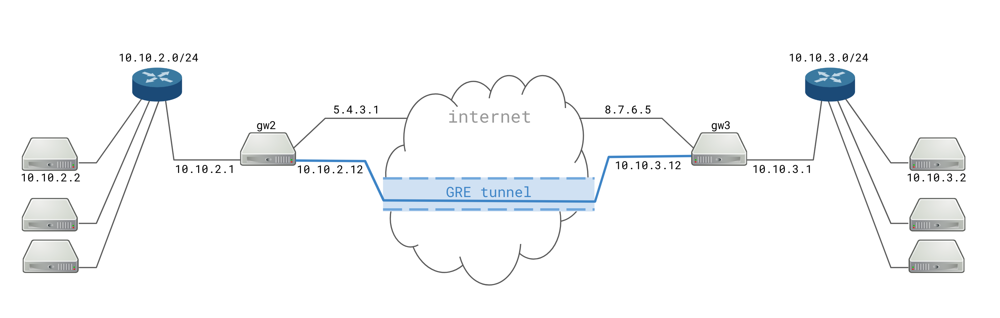

# Strongswan ansible role
- [What it is](what)
- [How it works](how-works)
- [How to use it](how-to)

### <a name="what"></a>What it is
This is an ansible role to create Strongswan based IPSec/GRE site-to-site tunnels.



### <a name="how-works"></a> How it works
During execution the playbook will:
- Download strongswan sourcecode from https://download.strongswan.org
- Configure it with the these [options](https://github.com/dennis-tsvetkov/ansible/blob/master/roles/strongswan/templates/run-configure.sh.j2)
- `make && make install` into `/usr/lib/strongswan`
- Render `tunnels.conf` config from configuration specified in [group_vars](https://github.com/dennis-tsvetkov/ansible/blob/master/group_vars/strongswan_example.yml#L6) into `/etc/strongswan/swanctl/conf.d/tunnels.conf`
- Generate and deploy certificates and keys if `auth=pubkey` in tunnels config
- Render into `/etc/strongswan/updown.sh` an [`updown.sh`](https://github.com/dennis-tsvetkov/ansible/blob/master/roles/strongswan/templates/updown.sh.j2) script which is responsible for GRE tunnel, ip address and routes
- Install `/etc/systemd/system/strongswan.service` as a systemd daemon, enable and start it

### <a name="how-to"></a> How to use it
- Clone the repo
- Make sure you have `ansible` and `netaddr` installed, otherwise do
```
pip install ansible==5.10.0 netaddr
```
- Put your hosts into `inventory` file, here is an [`example`](https://github.com/dennis-tsvetkov/ansible/blob/master/inventory.example)
- Edit the tunnels configuration in [`group_vars`](https://github.com/dennis-tsvetkov/ansible/blob/master/group_vars/strongswan_example.yml#L6) regarding your needs. Multiple tunnels might be specified. (Please note, the name of the group file under `group_vars` directory should be equal to the group name in `inventory` file).
- Apply the role by running the playbook with
```
ansible-playbook -i inventory playbooks/strongswan.yml
```
- Strongswan will be deployed to the hosts, systemd daemons will be started, tunnels will be created and connections will be established automatically

That's it. Now some checks can be done:
- exec `ip a`, the output should contains GRE tunnel interfaces
- `ip r` should contain the route to the remote network
- `swanctl --list-conns` should show the list of IPSec connections
- `swanctl --list-sas` should show the list of Security Associations and some traffic statistics

